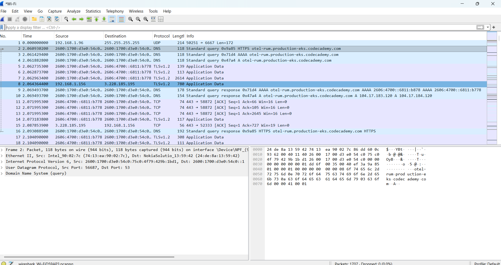
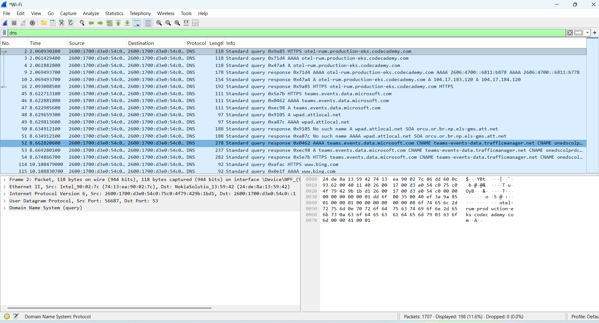

# Wireshark Network Analysis Lab

## Overview
This project demonstrates basic network traffic analysis using Wireshark. The lab focused on capturing live packets, filtering DNS traffic, analyzing protocols, and reviewing packet communication between devices and external services.

## Tools Used
- Wireshark
- Windows 11
- Npcap
- Wi-Fi Network Adapter

## Objectives
- Capture live network traffic
- Analyze DNS requests and responses
- Filter packets using Wireshark display filters
- Inspect packet details and protocol hierarchy
- Understand packet-level communication

## Activities Performed
- Installed and configured Wireshark and Npcap
- Captured live network packets on a Wi-Fi adapter
- Generated traffic by visiting websites
- Applied DNS filters to isolate DNS traffic
- Reviewed packet details including source, destination, and protocol information
- Used Protocol Hierarchy statistics to analyze captured traffic

## Key Findings
- DNS queries and responses were successfully captured
- TLS and DNS traffic were identified during browsing activity
- Multiple protocols were observed during live capture sessions
- Protocol Hierarchy statistics displayed overall traffic distribution

## Skills Learned
- Packet capture and analysis
- DNS traffic inspection
- Protocol analysis
- Wireshark filtering
- Network troubleshooting fundamentals
- Basic traffic investigation

## Screenshots
### Live Packet Capture

### DNS Traffic Analysis

### Protocol Hierarchy Statistics

## Resume Bullet
- Performed packet capture and DNS traffic analysis using Wireshark to inspect network communication and analyze packet-level activity in a virtual lab environment.
